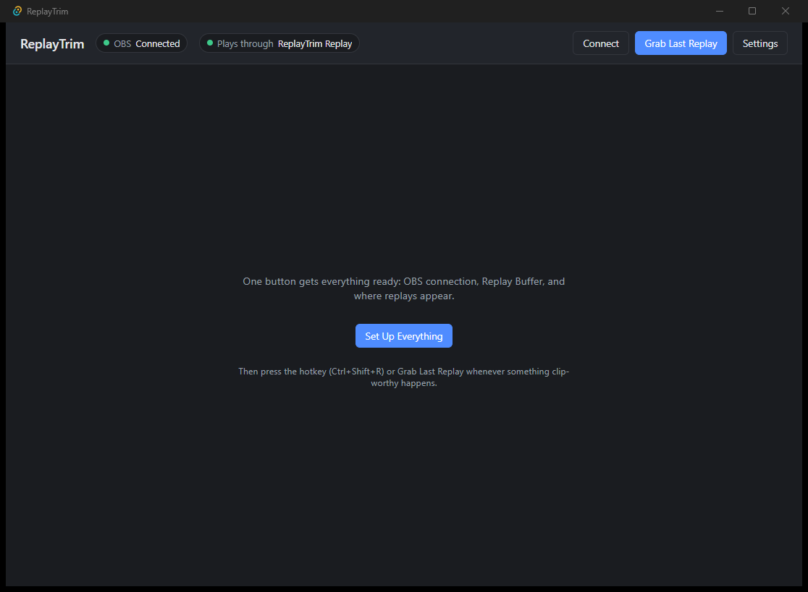

# ReplayTrim

Instant replays for OBS with a **visual trim**. Grab the last few minutes from OBS's Replay Buffer on a hotkey, drag two handles over an audio waveform to cut the moment, and play it on stream — all in seconds, all without leaving OBS.

No OBS plugins to install: ReplayTrim talks to OBS's built-in WebSocket server (OBS 28+).



## Why

OBS can save its replay buffer, and plugins can play a file back — but picking *the right five seconds* out of a three-minute buffer has always meant blind hotkey-nudging or opening a video editor mid-stream. ReplayTrim's whole reason to exist is the trim step: you **see** the video and its waveform, so the loud moment is visually obvious, and two drag handles cut exactly that.

## Features

- **Grab on a global hotkey** (default `Ctrl+Shift+R`) — works while your game is focused
- **Visual trim** — video preview with a waveform timeline; drag handles live-seek the video so you pick cut points by eye; fast keyframe trim (instant) or frame-accurate re-encode
- **Everything in an OBS dock** — grab, trim, and send without leaving OBS; two layouts (stacked or tabbed), collapsible preview for a condensed panel
- **Instant Replay** — one press plays the whole buffer on stream immediately, no trim
- **On-stream playback, two flavors** — a transparent browser-source overlay that fades in/out around the clip (with hover controls via OBS's Interact window), or a classic Media Source that shows/hides itself
- **Clip library** — recent grabs and trims listed with one-press replay, re-trim, and delete; plus a folder browser for everything else in your recordings folder
- **Playback controls everywhere** — replay / pause / hide from the dock, hotkeys, or the overlay itself (hide is a ~12 ms panic button)
- **One-button setup** — connects to OBS, starts the Replay Buffer, and creates the on-stream source for you

## Install

1. Download the installer from [Releases](https://github.com/sniperdude24/replaytrim/releases)
2. Prerequisites:
   - **OBS Studio 28+** with the WebSocket server enabled (Tools → WebSocket Server Settings) and the Replay Buffer configured (Settings → Output → Replay Buffer)
   - **ffmpeg** on your PATH (`winget install ffmpeg`)
3. Run ReplayTrim, enter your OBS WebSocket password in Settings, and click **Set Up Everything**

### Stream Deck plugin (optional)

Download `com.davidwallace.replaytrim.streamDeckPlugin` from [Releases](https://github.com/sniperdude24/replaytrim/releases) and double-click it — Stream Deck installs it. Five keys: Grab & Trim, Instant Replay, Replay Again, Pause/Resume, and Hide Replay. Requires the ReplayTrim app to be running. Source lives in [`streamdeck-plugin/`](streamdeck-plugin/).

### Add the OBS dock (recommended)

OBS → View → Docks → **Custom Browser Docks** → add:

```
http://127.0.0.1:8930/dock
```

The full workflow — grab, trim, send, clip library — now lives inside OBS. Use the ⇆ button to switch between stacked and tabbed layouts.

## Usage

1. Something clip-worthy happens → press the grab hotkey (or the dock's **Grab & Trim**)
2. The clip opens with its waveform — drag the two handles to the moment (the video follows your drag frame-by-frame), click the waveform to jump around
3. **Send & Play** — the trimmed clip plays on stream and hides itself when it ends

Or press the **Instant Replay** keybind and skip the trim entirely.

Trimmed clips are saved to a `ReplayTrim` folder next to your OBS recordings, and the last few grabs and trims stay one click away in the dock's Recent clips list.

## Building from source

Requires Rust (stable-msvc), Node.js 20+, and the Visual Studio Build Tools.

```bash
npm install
npm run tauri dev     # development
npm run tauri build   # installers in src-tauri/target/release/bundle/
```

## Notes for the curious

- OBS control is pure [obs-websocket v5](https://github.com/obsproject/obs-websocket) — replay saves via `SaveReplayBuffer`/`GetLastReplayBufferReplay`, playback via `SetInputSettings` + `TriggerMediaInputAction`, visibility via `SetSceneItemEnabled`
- Waveforms come from ffmpeg's `showwavespic` (with sqrt scaling so quiet audio stays visible); the same pass measures peak volume and warns you when a clip is silent
- Exports are written atomically (temp file + rename) with `+faststart`, under unique names, because OBS holds the previously-played file open
- The local server binds to `127.0.0.1` only and serves only files ReplayTrim created or grabbed

## License

[MIT](LICENSE)
